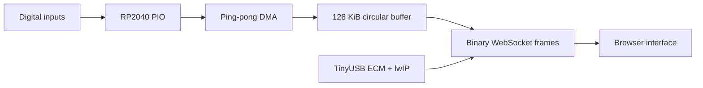

# RP2040 USB Web Logic Analyzer

A browser-controlled, 24-channel digital logic analyzer built on the Raspberry Pi Pico. The firmware captures GPIO data with the RP2040's PIO and DMA hardware while simultaneously serving a self-contained web interface over USB Ethernet, HTTP, and WebSockets.

No native host application or device driver installation is required. Connect the Pico by USB, open `http://192.168.7.1`, configure the capture, and receive binary sample data directly in a modern browser.

> **Status:** Working engineering prototype. Capture, continuous streaming, channel selection, binary transport, sequence tracking, and overrun reporting are implemented. The current browser interface also serves as a protocol and diagnostics console.

## Highlights

- Captures as many as 24 digital channels using RP2040 PIO state machines.
- Uses ping-pong DMA to move samples into a 128 KiB circular buffer independently of WebSocket transmission.
- Supports 8-, 16-, and 24-channel acquisition modes with one-, two-, and four-byte raw samples.
- Streams binary capture data to a browser over WebSockets.
- Exposes the device as a USB ECM network adapter using TinyUSB and lwIP.
- Provides DHCP and a fixed device address at `192.168.7.1`.
- Serves the complete browser interface from Pico flash; no internet connection or installed application is needed.
- Reports sequence numbers, sample counts, configured sample rate, device timestamps, and buffer overruns.
- Uses a fixed channel-to-bit relationship instead of repacking selected channels.
- Integrates pinned upstream projects through Git submodules and a small, reviewable compatibility patch.

During development testing, continuous streaming at a configured 100,000 samples per second delivered approximately 99,981 samples per second with no reported overruns. Actual performance depends on sample width, chunk size, browser behavior, and the host USB stack.

## System architecture



The acquisition and transport paths are deliberately separated. PIO samples the GPIO inputs without requiring the CPU to service every sample. DMA transfers the PIO receive FIFO into RAM, while the main application continues polling TinyUSB, lwIP, and the WebSocket server.

### Binary analysis frames

Analysis modes prepend a packed 40-byte header to each sample block:

| Field | Size | Description |
| --- | ---: | --- |
| Magic | 4 bytes | Protocol identifier |
| Sequence | 4 bytes | Monotonically increasing block sequence |
| Sample count | 4 bytes | Samples contained in the payload |
| Sample rate | 4 bytes | Configured samples per second |
| Overruns | 4 bytes | Number of overwritten unread chunks |
| Payload bytes | 4 bytes | Binary payload length |
| First sample | 8 bytes | Absolute index of the first sample |
| Device time | 8 bytes | RP2040 timestamp in microseconds |

The browser compares sequence and sample indices to detect missing blocks and compares delivered samples against elapsed browser time.

## Raw channel layout

Samples retain their GPIO-relative bit positions. Selecting channels controls the capture width and browser display mask; it does not reorder the returned data.

| Analyzer probe | RP2040 GPIO | Raw sample bit |
| ---: | ---: | ---: |
| 1 | GPIO2 | 0 |
| 2 | GPIO3 | 1 |
| ... | ... | ... |
| 21 | GPIO22 | 20 |
| 22 | GPIO26 | 24 |
| 23 | GPIO27 | 25 |
| 24 | GPIO28 | 26 |

Bits 21 through 23 are unused in 24-channel samples because GPIO23 through GPIO25 are not analyzer inputs. The raw 24-channel representation therefore uses a 32-bit word rather than a packed three-byte value.

The artificial edge used to start finite captures is generated on the upstream firmware's dedicated trigger input, GPIO1. It does not consume or modify an analyzer channel.

## Capture modes

The firmware selects the smallest storage mode capable of representing the highest enabled channel:

| Highest enabled probe | Storage | Bytes per sample |
| --- | --- | ---: |
| 1–8 | 8-bit | 1 |
| 9–16 | 16-bit | 2 |
| 17–24 | 32-bit raw word | 4 |

Available operations include:

- `SINGLE_CAPTURE`
- `CAPTURE_CHAIN_START` / `CAPTURE_CHAIN_STOP`
- `CAPTURE_CHAIN_ANALYSIS_START` / `CAPTURE_CHAIN_ANALYSIS_STOP`
- `STREAM_START` / `STREAM_STOP`
- `STREAM_ANALYSIS_START` / `STREAM_ANALYSIS_STOP`

Runtime configuration is sent through the same WebSocket connection:

```text
SET_FREQ 100000
SET_CHUNK_SIZE 1024
SET_CHANNEL_MASK 000003
```

The channel mask is hexadecimal. `000003` enables probes 1 and 2.

## Upstream integration

This project builds on three upstream codebases while keeping its own changes explicit:

- **TinyUSB lwIP web-server example** supplies the USB networking foundation, including USB ECM, lwIP, DHCP, and device polling. `tinyusb_main_bridge.c` includes the original example entry point under a renamed symbol and exposes the initialization and task functions needed by this application.
- **pico-ws-server** provides HTTP and WebSocket handling on port 80. It is included as a pinned Git submodule. A local patch makes its CYW43 synchronization dependency optional so it can operate over TinyUSB Ethernet instead of Pico W Wi-Fi.
- **LogicAnalyzer** supplies the underlying RP2040 capture implementation. It is included as a pinned Git submodule and wrapped by `logic_analyzer_bridge.c`, which adds the project's fixed raw-channel configuration, chained capture, continuous streaming, DMA progress accounting, and overrun detection.

The submodule approach makes the exact upstream revisions reproducible. The pico-ws-server adaptation remains a patch rather than a fork, keeping the integration changes easy to audit and reapply when evaluating upstream updates.

## Requirements

- Raspberry Pi Pico / RP2040 target
- ARM GNU embedded toolchain
- CMake 3.20 or newer
- Raspberry Pi Pico SDK
- `picotool` for command-line flashing
- Git with submodule support

The analyzer inputs use RP2040 GPIO voltage levels. Do not connect 5 V logic directly to the Pico.

## Build

Clone the repository and initialize its submodules:

```sh
git clone --recurse-submodules \
  https://github.com/SCI4THIS/pico-web-logic-analyzer.git
cd pico-web-logic-analyzer
```

Apply the USB-ECM compatibility patch to pico-ws-server:

```sh
./submodules/apply-pico-ws-server-patch.sh
```

Configure and build:

```sh
export PICO_SDK_PATH=/path/to/pico-sdk

cmake -S . -B build \
  -DBOARD=raspberry_pi_pico

cmake --build build --parallel
```

Flash the firmware:

```sh
picotool load -f build/net_lwip_webserver.uf2 --execute
```

The patch can be removed from the submodule with:

```sh
./submodules/apply-pico-ws-server-patch.sh --revert
```

## Use

1. Connect the flashed Pico to the host over USB.
2. Wait for the USB Ethernet interface to appear and receive an address in `192.168.7.0/24`.
3. Browse to [http://192.168.7.1](http://192.168.7.1).
4. Select the input probes, sample frequency, and WebSocket chunk size.
5. Press **Configure**, then start a capture or stream operation.

The Pico normally assigns the host an address such as `192.168.7.2` through its embedded DHCP server. If DHCP is unavailable, assign the host interface a static address in the same subnet.

## Linux USB networking note

USB ECM is selected because it proved more reliable in development testing than RNDIS on Linux. RNDIS produced recurring `NETDEV WATCHDOG` transmit-queue timeouts, while ECM provided stable DHCP, HTTP, and WebSocket communication.

After reflashing or reconnecting the device, Linux network management may briefly retain neighbor or interface state from the previous USB session. If necessary, wait for the interface to settle or inspect it with:

```sh
ip address
ip route get 192.168.7.1
ip neigh show 192.168.7.1
```

## Repository guide

| Path | Purpose |
| --- | --- |
| `src/main.cpp` | Application commands, WebSocket framing, and cooperative tasks |
| `src/logic_analyzer_bridge.c` | PIO/DMA capture integration and streaming |
| `src/tinyusb_main_bridge.c` | Bridge to the TinyUSB network example |
| `web/index.html` | Self-hosted configuration and diagnostics interface |
| `submodules/pico-ws-server.patch` | USB-network compatibility change |
| `submodules/apply-pico-ws-server-patch.sh` | Idempotent patch/apply helper |

## Project scope

This is an experimental embedded instrument and engineering demonstration, not a calibrated commercial logic analyzer. Its current interface emphasizes capture validation, transport diagnostics, and performance measurement.

## Acknowledgments

- [TinyUSB](https://github.com/hathach/tinyusb)
- [pico-ws-server](https://github.com/cadouthat/pico-ws-server)
- [LogicAnalyzer](https://github.com/gusmanb/logicanalyzer)
